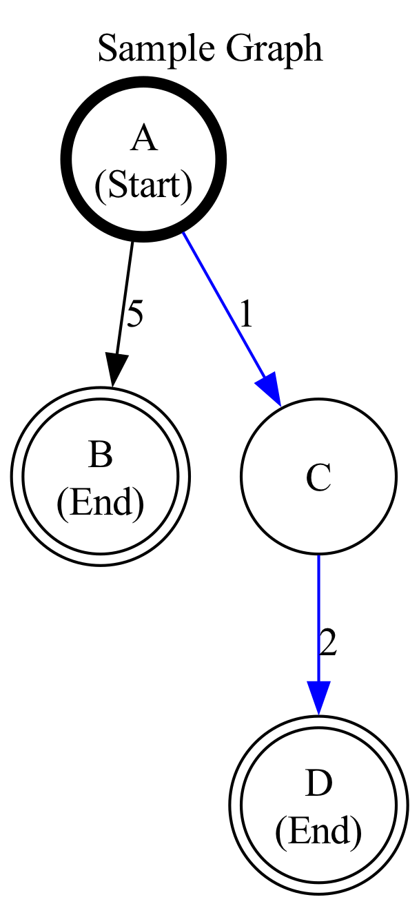

# Standards

Wir folgen Standards und Konventionen, damit die Aufgaben bei uns einheitlich aussehen.
Die Beispielaufgaben, welche wir erstellt haben, folgen jene Konventionen.

## Wesentliche Punkte

### Feedback:

"Correct." und "Incorrect." sind jeweils das erste Wort in dem Feedback. Danach kommt eine leere Zeile und in der Zeile danach kommt "Solution: ..."
Beispiel:

```
Incorrect. Feedback here.

Solution: 42
```

Beispiel mit mehr als einer Lösung:

```
Incorrect. Feedback here.

Solution:
    •42
    •46
```

### FillIn Felder

Bei einer falschen Antwort, soll das FillIn Feld rot gefärbt werden (Feedback --> More Feedbacks --> Add field to be marked --> Color: #ff0000). Bei einer richtigen Antwort, wird die Farbe des Feldes nicht geändert.

### Code in Codeblöcken

- Indentierung von 2 Spaces.
- Globale Funktionen sind durch 2 leere Zeilen getrennt.
- Methoden innerhalb einer Klasse werden durch 1 leere Zeile getrennt.
- Functions- und Variablennamen werden in Snake-case geschrieben, z.B.: binary_search.
- Klassennamen werden in Pascal-case geschrieben, z.B.: BinarySearchTree.
- (Globale) Konstanten werden in großgeschriebenem Snake-case geschrieben. Also Großbuchstaben mit Unterstrichen. Beispiel: MAX_DISTANCE.
- Globale Variablen werden in Snake-case geschrieben. Achtet darauf, dass dies nur für Variablen gilt. Globale Konstanten werden wie oben genannt, in großgeschriebenem Snake-case, geschrieben.

Indentierung und leere Zeilen sollten durch das Skript (Codebloecke_in_Aufgaben_hinzufuegen) selbst geregelt werden. Auf korrekte Benennung der Variablen sollt ihr bitte achten.

### Codeblöcke

Die Codeblöcke kommen ganz am Ende der Aufgabenbeschreibung mit einer leeren Zeile davor.
Beispiel:

```html
<div>Hier ist die Aufgabenbeschreibung</div>
<div>&nbsp;</div>
<details ...>Rest von dem Kopiertem...</details>
```

### Latex Notations

Falls etwas mathematisches Angegeben werden soll, muss Latex benutzt werden.

**Big-O:**
`$\mathcal{O}(n)$` wird $\mathcal{O}(n)$

**Theta:**
`$\Theta{O}(n)$` wird $\Theta(n)$

**Omega:**
`$\Omega(n)$` wird $\Omega(n)$

**Small-O:**
`$o(n)$` wird $o(n)$

**Small-Omega:**
`$\omega(n)$` wird $\omega(n)$

**Tilde:**
`$\sim(n)$` wird $\sim(n)$

---

Do's and don't

❌ `$ x * y $` wird $x*y$
✅ `$ x \cdot y $` wird $x \cdot y$

### Graphen

Bitte verwende genau dieselben Einstellungen, wenn du solche Graphen erstellst.

Beispielgraph:



Partial example code from the graph above:

**Haupteinstellungen:**

```py
dot.attr("graph", center="True", dpi="300", label="Sample Graph", labelloc = "t")
```

**Start-Knoten:**

```py
dot.node("node_a", "A\n(Start)", shape="circle", penwidth="4",
fixedsize="true", width="0.75", height="0.75")
```

**Pfad:**
If you want to mark a certain path do it like this:

```py
dot.edge("node_a", "node_c", label="1", color="blue")
dot.edge("node_c", "node_d", label="2", color="blue")
```

**Normaler Knoten:**

```py
dot.node("node_c", "C", shape="circle", fixedsize="true",
width="0.75", height="0.75")
```

**End-Knoten:**

```py
dot.node("node_b", "B\n(End)", shape="doublecircle", fixedsize="true",
 width="0.75", height="0.75")
```

# Standards (english version)

We follow specific standards and conventions to ensure that all tasks have a consistent look and feel.
The example tasks we’ve created adhere to these conventions.

## Key Points

### Feedback

Use "Correct." and "Incorrect." as the **first word** of the feedback.
After that, leave an **empty line**, followed by the solution explanation starting with "Solution: ..."

Example:

```
Incorrect. Feedback here.

Solution: 42
```

Example with more than one solutions:

```
Incorrect. Feedback here.

Solution:
    •42
    •46
```

### FillIn Fields

For incorrect answers, the FillIn field should be highlighted in **red**.
→ _Feedback → More Feedbacks → Add field to be marked → Color: `#ff0000`_
For correct answers, the field color should remain **unchanged**.

### Code in Code Blocks

- Indentation: **2 spaces**
- Global functions: separated by **2 blank lines**
- Methods within a class: separated by **1 blank line**
- Function and variable names: **snake_case** (e.g., `binary_search`)
- Class names: **PascalCase** (e.g., `BinarySearchTree`)
- Global constants: **UPPER_SNAKE_CASE** (e.g., `MAX_DISTANCE`)
- Global variables: **snake_case** (same as normal variables).
  ⚠️ Only constants should use UPPER_SNAKE_CASE.

> Note: Indentation and line breaks should be handled automatically by the script from `Codebloecke_in_Aufgaben_hinzufuegen`.
> Please pay attention to correct variable naming.

### Code Blocks

Code blocks should always appear **at the end** of the task description, with **one empty line** before them.

**Example:**

```html
<div>This is the task description</div>
<div>&nbsp;</div>
<details>
  <!-- Insert copied code block content here -->
</details>
```

### Latex Notations

If you use anything related to mathematics. Please use latex notation.

**Big-O:**
`$\mathcal{O}(n)$` will be $\mathcal{O}(n)$

**Theta:**
`$\Theta{O}(n)$` will be $\Theta(n)$

**Omega:**
`$\Omega(n)$` will be $\Omega(n)$

**Small-O:**
`$o(n)$` will be $o(n)$

**Small-Omega:**
`$\omega(n)$` will be $\omega(n)$

**Tilde:**
`$\sim(n)$` will be $\sim(n)$

---

Do's and don't

❌ `$ x * y $` will be $x*y$
✅ `$ x \cdot y $` will be $x \cdot y$

### Graphs

Please use the exact same settings if you are doing graphs like this.
Example graph:


Partial example code from the graph above:

**Main Settings:**

```py
dot.attr("graph", center="True", dpi="300", label="Sample Graph", labelloc = "t")
```

**Start-Node:**

```py
dot.node("node_a", "A\n(Start)", shape="circle", penwidth="4",
fixedsize="true", width="0.75", height="0.75")
```

**Paths:**
If you want to mark a certain path do it like this:

```py
dot.edge("node_a", "node_c", label="1", color="blue")
dot.edge("node_c", "node_d", label="2", color="blue")
```

**Node:**

```py
dot.node("node_c", "C", shape="circle", fixedsize="true",
width="0.75", height="0.75")
```

**End-Node:**

```py
dot.node("node_b", "B\n(End)", shape="doublecircle", fixedsize="true",
 width="0.75", height="0.75")
```

